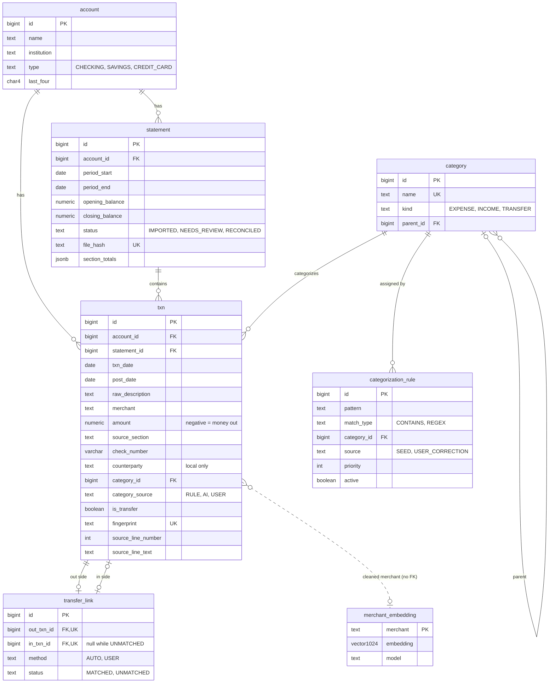

# Finalysis

Local-first personal financial analytics: import bank and card statements, categorize spending,
and ask questions about your own data. Spring Boot backend + React (Vite, TypeScript) frontend.
Features and their status are tracked in [docs/requirements.md](docs/requirements.md).

```
backend/      Spring Boot 4 REST API (Java 21, Maven wrapper) — runs on :8080
frontend/     React 19 + Vite app — runs on :5173, proxies /api to :8080
sample-data/  Synthetic bank and card statements (see "Sample data")
postman/      Postman collection and local environment for the API
scripts/      Developer scripts (dev database reset)
tools/        Sample data generator
compose.yaml  Postgres 17 + pgvector
```

## Local development

**Prerequisites:** JDK 21+, Node.js 22+, Docker (for the database and for Testcontainers).

```sh
cp .env.example .env          # then set POSTGRES_PASSWORD
docker compose up -d db

# Terminal 1 — backend (Flyway applies migrations at startup)
cd backend
./mvnw spring-boot:run

# Terminal 2 — frontend
cd frontend
npm install
npm run dev
```

Open http://localhost:5173. The page calls `GET /api/status` and shows the backend status.

### Tests

```sh
cd backend && ./mvnw verify
cd frontend && npm test
```

Backend tests always run against a throwaway Testcontainers Postgres and never touch the dev
database. `DevDatabaseGuard` fails any test context whose datasource points at the compose database.

### Postman

1. Import both files from `postman/`: `Finalysis.postman_collection.json` and
   `Finalysis-Local.postman_environment.json`.
2. Select the **Finalysis Local** environment (`baseUrl` = `http://localhost:8080`).
3. Run the **Accounts → Setup: create sample accounts** folder once. It creates the four
   sample-data accounts and stores their ids for the other requests.
4. Run the rest of the collection.

Setup creates duplicate accounts if you run it twice, because accounts have no uniqueness rule.
To start clean, reset the dev database (below).

### Database client

To browse the dev database with DBeaver or a similar client, create a PostgreSQL connection with
host `localhost`, port `POSTGRES_PORT` (default 5432), database `POSTGRES_DB`, and user and password
from `.env`. The port is bound to 127.0.0.1 only. Tick **Read-only connection** (in DBeaver, on the
connection's General page): the schema belongs to Flyway and the data to the app.

### Resetting the dev database

> ⚠️ **`scripts/reset-dev-db.sh` permanently deletes all local data:** every account, statement,
> and transaction in the dev database. There is no undo.

```sh
scripts/reset-dev-db.sh
```

The script removes the compose `db` container and its `pgdata` volume, then starts a fresh empty
database. Start the backend afterwards so Flyway re-applies the migrations. It asks you to type
`reset` to confirm. It refuses to run if it is given any arguments, if stdin is not a terminal, or
if anything suggests a non-local target: a remote `DOCKER_HOST` or Docker context, `DOCKER_CONTEXT`,
`COMPOSE_FILE`, `COMPOSE_PROJECT_NAME` or `SPRING_DATASOURCE_URL` set, or a `POSTGRES_HOST` other
than localhost.

## Data model

Postgres 17 with pgvector. The schema is owned by Flyway (`backend/src/main/resources/db/migration`).
Hibernate only validates it. Requirements: DAT-01 to DAT-08 in [docs/requirements.md](docs/requirements.md).



| Table | Purpose |
|---|---|
| `account` | A checking, savings, or credit card account. Only the last four digits of the account number are stored. |
| `statement` | One imported statement file for one account and period, with its opening and closing balances, printed section totals, and reconciliation status. A file hash and a unique (account, period) block double imports. |
| `category` | Seeded spending and income categories, each with a kind. `TRANSFER` covers all movement between the user's own accounts. |
| `txn` | One statement row: dates, raw description, cleaned merchant, signed amount, category and who set it, and where it came from in the source file. |
| `categorization_rule` | Merchant pattern → category rules. Rules run before any AI, and user corrections become new rules. |
| `transfer_link` | Pairs the outgoing and incoming side of a transfer between the user's own accounts, such as a card payment. |
| `merchant_embedding` | One embedding per cleaned merchant name, used to find similar merchants for categorization and search. |

### Design decisions

- **`txn_date` vs `post_date`.** `post_date` is the date printed in the statement's date column.
  `txn_date` is when the purchase happened: a date embedded in the description
  (`CHECKCARD 0704 …`) if there is one, otherwise the posting date. Analytics group by `txn_date`.
- **Two-level reconciliation.** Each row records the statement section it was printed in
  (`source_section`: deposit, withdrawal, check, fee, …), and `statement.section_totals` stores the
  printed total per section. Import first checks each section's rows against its printed total,
  then checks opening balance + all rows = closing balance. A missing row shows up in a specific
  section, not just as an overall mismatch.
- **Fingerprint.** `txn.fingerprint` is a SHA-256 of raw printed values only (account, printed
  date, amount, description, section) plus an occurrence number. Re-importing a statement
  reproduces the same fingerprints, so its rows are skipped, while two genuinely identical charges
  get occurrence 1 and 2 and are both kept. Derived values (merchant, category, embedded
  `txn_date`, counterparty) are excluded because they change as parsing improves. If they were
  hashed, a better parser would re-insert every old row.
- **Source tracing.** `source_line_number` and `source_line_text` record where each row came from
  in the original file, so any total can be traced back to statement lines.
- **`counterparty` is local only.** Person-to-person payees and payers (e.g. Zelle) are stored for
  the user's own use and are never sent to a cloud model.
- **`transfer_link`.** `in_txn_id` is nullable so a card payment can be marked as a transfer before
  the card's statement is imported (`status = UNMATCHED`). A CHECK constraint ties `MATCHED` to a
  non-null `in_txn_id`. The unique constraints stop a txn from appearing twice on the same side,
  and the V3 trigger also stops it from being the out side of one link and the in side of
  another, so a txn belongs to at most one link.
- **`merchant_embedding`.** One row per cleaned merchant name, not per transaction. Merchants repeat,
  so each is embedded once. `vector(1024)` is a dimension that both the cloud and the local
  embedding models produce, so both share one schema. A cosine HNSW index serves nearest-neighbour
  search. The `model` column records which model produced each vector, so rows can be re-embedded
  when the model changes.
- **Categories are bank-agnostic.** They describe the kind of spending, not any institution's own
  category labels, so one set applies to every account.

### Migrations

| Version | Purpose |
|---|---|
| V1 `init` | Initial schema: all seven tables, constraints, indexes, and the pgvector extension. |
| V2 `seed_categories` | Seeds the categories: the sample-data answer key's categories plus general-purpose ones. |
| V3 `transfer_link_txn_once` | Trigger ensuring a txn belongs to at most one transfer link, on either side. |
| V4 `account_name_lengths` | CHECK constraints limiting account name and institution to 1–100 characters. |

Applied migrations are never edited. Every schema change is a new migration.

## API

| Method | Path | Purpose | Success |
|---|---|---|---|
| `GET` | `/api/status` | Backend health, shown by the frontend | 200 |
| `POST` | `/api/accounts` | Register an account (DAT-01) | 201, `Location` header |
| `GET` | `/api/accounts` | List accounts, sorted by name | 200 |
| `GET` | `/api/accounts/{id}` | Get one account | 200 |
| `PATCH` | `/api/accounts/{id}` | Rename an account | 200 |
| `GET` | `/api/categories` | List the seeded categories (DAT-02) | 200 |

- **Strict bodies.** Request bodies reject unknown fields. `PATCH /api/accounts/{id}` accepts only
  `name`, so trying to change the type or last four digits returns a 400 that names the field.
  Accounts cannot be deleted.
- **Errors** are RFC 9457 problem details (`application/problem+json`). Validation errors add an
  `errors` list of `{field, message}`:

  ```json
  {
    "title": "Invalid request",
    "status": 400,
    "detail": "One or more fields are invalid",
    "instance": "/api/accounts",
    "errors": [
      { "field": "lastFour", "message": "must be exactly 4 digits" },
      { "field": "name", "message": "must not be blank" }
    ]
  }
  ```

| Status | When | Body |
|---|---|---|
| 400 | Invalid field, unknown field (`"is not allowed"`), or bad enum value (lists the allowed values) | `errors[]` |
| 400 | Malformed JSON | `detail` only |
| 404 | Unknown id, e.g. `Account 42 not found` | `detail` |
| 409 | A database constraint was violated | generic `detail` |
| 500 | Unexpected error | generic `detail` |

Constraint names, SQL, and stack traces are logged on the server and never returned. Spring's own
errors (405, 415, a non-numeric id) use the same format.

## Sample data

`sample-data/` holds fully synthetic statements for six months (April 1 – September 30, 2026).
Every institution, account number, and employer is fictional. Merchant strings imitate real
card descriptors (`SQ *BLUE BEAN CAFE 4412`, `AMZN MKTP US*2K4L91`) so categorization is realistic.

| Account | Format | Statement period |
|---|---|---|
| Northfield Bank Checking (…1001) | `Date,Description,Debit,Credit,Balance`, `MM/DD/YYYY` | calendar month |
| Northfield Bank Savings (…1002) | same as checking | calendar month |
| Apex Rewards Visa (…2001) | `Transaction Date,Post Date,Description,Category,Amount`, `YYYY-MM-DD`, purchases positive | 15th – 14th, named by closing month |
| Summit Cash Card (…3001) | `Trans. Date,Merchant Name,Amount`, `DD-Mon-YYYY`, purchases negative | calendar month |

- `statements/` — one CSV per account per statement period, e.g. `apex-visa_2026-04.csv`.
  The first and last Apex cycles extend past the data range, so they are only partly filled.
- `answer-key.csv` — every transaction with its normalized amount (negative = money out),
  expected category, `is_transfer`, and anomaly tag. Savings transfers and card payments are
  transfers on both sides; card payments appear in checking and on the card 1–3 days apart,
  with different descriptions.
- `statements-manifest.csv` — period and opening/closing balance per statement, in the same
  sign convention (card balances owed are negative), so `opening + sum(amounts) = closing`.
- `broken/summit-card_2026-06.csv` — the June Summit statement with one transaction missing.
  Its manifest balances are correct, so it does not reconcile; use it to test the review queue.

**Planted anomalies**

| Anomaly | Where | Answer-key tag |
|---|---|---|
| Music subscription price increase | `SPOTIFY USA` $11.99 → $12.99 from July | `price_increase` |
| Duplicate charge | `SAFEWAY #1234` $84.12 twice on June 13 (Apex) | `duplicate` |
| Unusually large purchase | `BEST BUY` $899.99 on August 22 (Apex), ~10x a normal shopping trip | `large_purchase` |
| Rising dining spend | Summit dining totals increase every month | — (trend) |
| Missing bill | No `SKYWAVE INTERNET` payment in September | — (absent row) |

**Regenerating.** Output is byte-identical on every run (fixed seed and dates). From the repo root:

```sh
java tools/SampleDataGenerator.java
```

CI regenerates the data and fails if it differs from what is committed. `SampleDataTest` checks
that every statement reconciles with the manifest, the broken one does not, every card payment
has a matching checking transfer, and the answer key matches the statements.

## License

[MIT](LICENSE)
